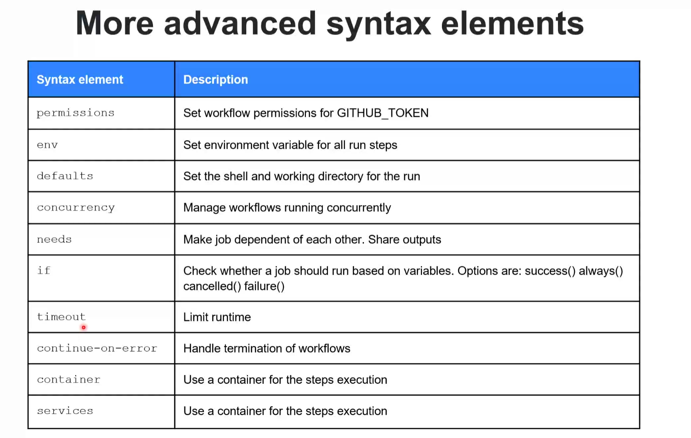

# general notes

## webhooks
- Trigger
    - webhook
    - scheduled
    - manual
    - starter.yml

## jobs and steps
- Map - run in parallel
- can be chanined using `needs` keyword
- runs on a runner in one process
- contains a sequence of steps
- steps can be a shell command (run) or an action (uses)

## actions
    - reusable step 
    - Lives in a git repo
    - synatx:
        ```
        {owner}/{repo}@{ref}
        {owner}/{repo}/{path}@{ref}
        ./.github/actions/my-action
        ```
    - pass vars to action:
        - `with:`
        - `env:`

### docker action
    - run a docker container as an action

## contexts and expressions


## workflow commands



## actions
### conainter action:

example:


### javascript


### composite


### [best practices](https://github.com/actions/toolkit)


# Day 2

## CD workflows
- basic workflow: 
- build the docker container -> test the container -> Scan for secrets, vulerbality scanner -> sign the container

### Concurrency


### CD with actions best practices


building image in github action:
https://azureglobalblackbelts.com/2023/11/09/part1-notation-usage.html
https://azureglobalblackbelts.com/2023/11/09/part2-aks-image-verification.html

### action policies


###
runner information: 
- https://github.com/actions/runner-images
- https://docs.github.com/en/actions/using-github-hosted-runners/about-github-hosted-runners/about-github-hosted-runners#standard-github-hosted-runners-for-public-repositories 
- public road map: https://github.com/github/roadmap 
- https://github.com/jonico/awesome-runners
- https://github.com/actions/actions-runner-controller - aks/eks runners for k8s. 
- https://github.com/rajbos/actions-marketplace | hosting your own github actions internally for people to consume

###
https://github.com/aa-demo-org/.github 


